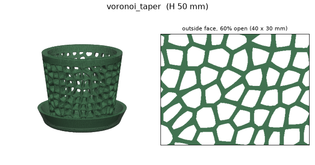
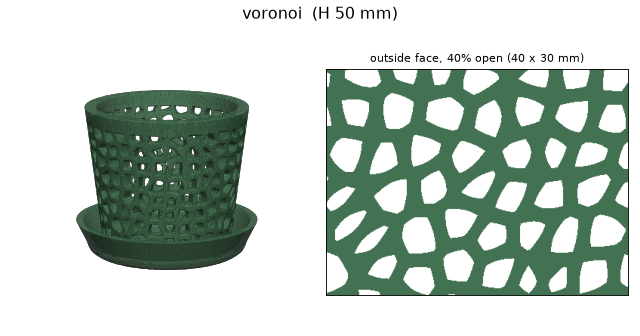
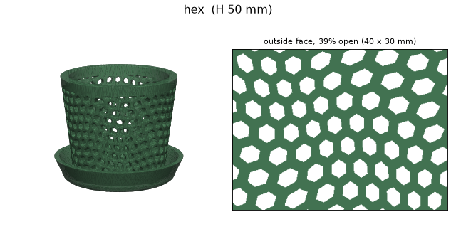
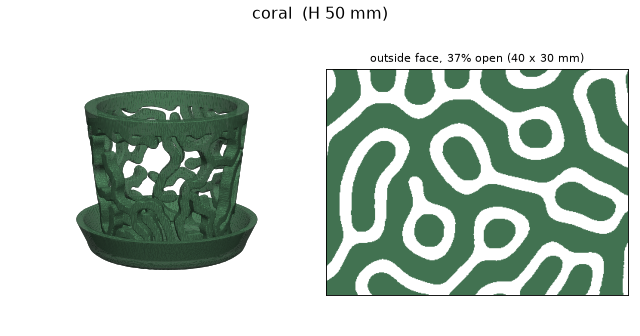
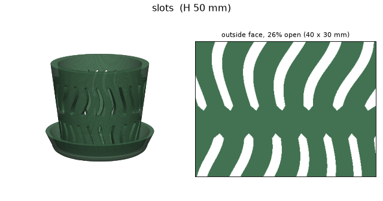
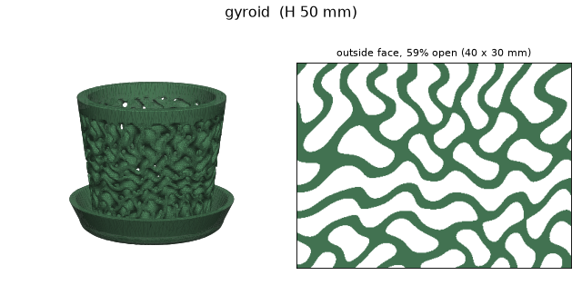
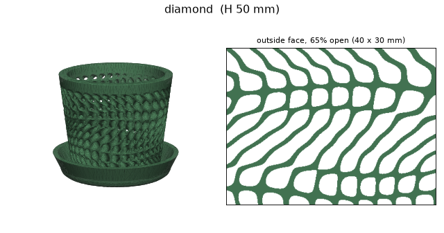

# Breathing plant pot

A single-piece, support-free, 3D-printable (FDM) plant pot. The wall is
perforated to let in as much air as possible without losing soil, and a
plain cup fused to the base catches drips and holds a small water reserve
that the soil wicks back up.

The pot is generated from code (an implicit field meshed with marching
cubes) and exported as STL + 3MF, with a PNG preview.

## Setup

```sh
uv sync                      # or: pip install -e .
```

This installs the `pots` and `pots-gallery` commands into the project venv. Run them with
`uv run pots ...`, or activate the venv and call `pots` directly
(`python -m pots` works too).

## Usage

All settings live in [`src/pots/config/config.yaml`](src/pots/config/config.yaml)
and have defaults. Override only what you want to change, as `key=value`:

```sh
pots                                  # build with the config defaults (size=small)
pots size=big                         # the 130 mm reference pot
pots size=small quality=draft         # fast low-res check of the 50 mm pot
pots size=big height=100              # start from a preset, change one value
pots pattern=coral design.wall=4      # another pattern, thinner wall
pots height=65 --show                 # print the final settings, don't build
pots -v                               # debug logging
pots --help                           # usage and the list of patterns
```

Settings use Hydra/OmegaConf syntax, so nested keys use dots
(`design.strut_out=1.2`) and a misspelled key is an error.

### Outputs

Written to `out` (default `output/<pattern>_h<height>/`):

| File | What |
|---|---|
| `pot_<pattern>.stl` | print file |
| `pot_<pattern>.3mf` | same mesh, ~5x smaller |
| `pot_<pattern>.png` | preview: outside, cut-away, vertical section, both wall faces at true scale with their open % |
| `config.yaml` | the exact settings used for this pot |

## Parameters

### General

| Key | Default | Description |
|---|---|---|
| `pattern` | `voronoi_taper` | Wall pattern, see [Patterns](#patterns). |
| `size` | `small` | Size preset: `big` or `small`, see [Size presets](#size-presets-srcpotsconfsize). |
| `height` | from `size` | Pot height in mm. **Drives the whole shape**, see [Scaling](#scaling-with-height). Minimum `base + rim + 10` (17.4 mm). |
| `preview` | `true` | Also render the PNG preview (~10 s). |
| `out` | `output/${pattern}_h${height}` | Output folder; existing files are overwritten. |
| `quality` | `full` | Mesh quality preset: `full` or `draft`. |

### Size presets (`src/pots/config/size/`)

Each preset sets the height and the wall thickness. Anything on the
command line still wins, so `size=big height=110` is a big pot made
110 mm tall.

| Key | `big` | `small` |
|---|---|---|
| `height` | 130 (151 mm wide) | 50 (~62 mm wide with the cup) |
| `design.wall` | 6.0 | 4.0 |

### Quality presets (`src/pots/config/quality/`)

| Key | `full` | `draft` | Description |
|---|---|---|---|
| `quality.voxel` | 0.3 | 0.6 | Mesh grid spacing in mm. Time and memory grow ~1/voxel³: full at 130 mm takes ~2–3 min and 2–3 GB RAM, draft ~1 min. Don't run several full builds in parallel. |
| `quality.faces` | 900 000 | 100 000 | Triangle budget; the mesh is decimated to this. |

You can also override a single value: `quality=draft quality.voxel=0.45`.

### Design sizes (`design.*`, mm)

Print-physics sizes: they depend on the nozzle and the soil, not on the
pot size, so they **do not scale** with `height`.

| Key | Default | Description |
|---|---|---|
| `design.wall` | from `size` | Pot wall thickness (radial). The pattern goes through it. Thicker = stiffer, longer funnels; thinner = lighter. 4 mm suits small pots. |
| `design.rim` | 5.0 | Solid band at the top, for stiffness and a clean edge. |
| `design.base` | 2.4 | Solid floor shared by pot and cup. The soil sits on it and wicks water from the cup. The pattern starts 1 mm above it. |
| `design.cup_wall` | 2.4 | Wall thickness of the drip cup. |
| `design.strut_in` | 2.2 | `voronoi_taper` only. Strut width on the soil side. Wider = smaller inner holes = less soil loss, less air. |
| `design.strut_out` | 1.1 | `voronoi_taper` only. Strut width on the outside. Keep ≥ ~1.1 (0.4 mm nozzle) and ≤ `strut_in` so holes widen outward. |

With the defaults, `voronoi_taper` is 58% open outside (typical hole
3.6 mm) and 29% open on the soil side (typical hole 2.5 mm).

## Scaling with height

`height` sets a scale factor `k = height / 130` applied to everything that
defines the *shape*:

- outer radius: 56·k at the bottom, 72·k at the top
- cup height (28·k) and moat gap at the bottom (5·k); the cup lip always
  sits 1 mm outside the top of the pot so drips land in it
- number of pattern cells around the pot, rounded to an integer so the
  pattern stays seamless and each cell keeps its size in mm

What stays fixed in mm: the `design` sizes, hole size, row height of the
cells, the lip overhang and the bottom chamfer. So a small pot has fewer,
same-size holes and a proportionally thicker wall.

## Patterns

Pick one with `pattern=<name>`. Each image shows the 50 mm pot (`size=small`)
from outside, next to a 40 x 30 mm true-scale swatch of the outer wall face
(white = open) with its open %.

| | |
|---|---|
| **`voronoi_taper`** (default), 2D, tapered: organic cells that flare outward like funnels. <br>  | **`voronoi`**, 2D: the same cells with straight-through holes and 1.8 mm struts. <br>  |
| **`hex`**, 2D: warped honeycomb, pointy-top cells, 1.8 mm struts. <br>  | **`coral`**, 2D: reaction-diffusion (Turing) labyrinth. <br>  |
| **`slots`**, 2D: narrow wavy vertical slots, air-pruning style. <br>  | **`gyroid`**, 3D lattice: graded density through the wall, no straight line of sight. <br>  |
| **`diamond`**, 3D lattice: Schwarz diamond, straighter 45° channels. <br>  | |

2D patterns are cut radially through the wall; 3D lattices are
tortuous channels. All wrap seamlessly around the pot. `coral` generates
its texture on first use at each height (slow) and caches it in
`~/.cache/pots` (or `$POTS_CACHE_DIR`).

### Regenerating the gallery

`pots-gallery` builds every pattern one after another, in memory, and
writes only these images to `docs/patterns/<name>.png` (no STL, 3MF or
config; use `pots pattern=<name>` for a printable pot).

```sh
pots-gallery                          # every pattern (a few minutes in total)
pots-gallery hex slots                # only these
pots-gallery quality=draft            # faster, coarser
pots-gallery size=big --images pics   # the 130 mm pot, images in pics/
pots-gallery height=90 design.wall=5  # any shape setting of `pots`
```

It takes the shape settings of `pots` (`size`, `height`, `design.*`,
`quality`). Mesh quality defaults to `quality.voxel=0.35
quality.faces=400000` (between draft and full, fine enough for the 1.1 mm
struts to show); any `quality=...` or `quality.*` on the command line
replaces that. Run it after changing a pattern so the README stays current.

## Printability rules

The generator follows these; keep them when changing the code:

- No supports anywhere.
- Every hole roof is a flat bridge no wider than the hole (≤ ~5 mm). The
  taper is done by shifting the pattern down as its edges recede, so holes
  only grow sideways and downward; a ceiling never rises toward the outside.
- Minimum strut ~1.1 mm (0.4 mm nozzle).
- 45° chamfer on the bottom outer edge (elephant foot).
- Every pattern is periodic around the circumference.

## Using it from Python

```python
from pots import Pot, generate
from pots.metrics import wall_metrics

pot = Pot(height=65, wall=4.0)                 # every size of one pot
mesh, field = generate(pot, "voronoi_taper", voxel=0.6, faces=100_000)
mesh.export("pot.3mf")
print(wall_metrics(field, pot))                # open %, hole size on both faces
```

## Code layout

```
src/pots/
  cli.py        `pots` command: config, build, export, preview
  gallery.py    `pots-gallery` command: every pattern + README images
  config/       Hydra config: config.yaml and the quality/ and size/ presets
  geometry.py   Pot: all dimensions, scaled from the height
  patterns.py   wall patterns (PATTERNS registry)
  coral.py      reaction-diffusion texture for `coral`, with its disk cache
  field.py      make_field(): wall + rim + base + cup as one implicit field
  sdf.py        field helpers (smin, cylindrical gyroid)
  mesh.py       slab-wise marching cubes, decimation and repair
  pipeline.py   generate(): field -> clean, watertight mesh
  metrics.py    open %, hole size and straight-through % of both wall faces
  preview.py    PNG preview and the small gallery image
tests/          pytest suite (uv run pytest)
docs/patterns/  gallery images used in this README (pots-gallery)
```

The model is an implicit field (negative = solid), meshed with marching
cubes in z-slabs, then decimated, reduced to its largest body and repaired.
Each build logs whether the mesh is watertight and a single body, plus the
wall metrics.

Hydra note: the config is loaded with Hydra's compose API rather than
`@hydra.main`, because hydra-core 1.3's own CLI crashes on Python 3.14.
The `key=value` syntax is the same; `--show` replaces `--cfg job`.

## Development

```sh
uv sync            # installs the dev group (pytest) too
uv run pytest      # ~15 s, includes a small draft build
```
