# Breathing plant pot

A single-piece, support-free, 3D-printable (FDM) plant pot. The wall is
perforated to let in as much air as possible without losing soil, and a
plain cup fused to the base catches drips and holds a small water reserve
that the soil wicks back up.

The pot is generated from code (an implicit field meshed with marching
cubes, or exact geometry for the patterns that support it) and exported
as STL + 3MF, with a PNG preview.

## Setup

```sh
uv sync                      # or: pip install -e .
```

This installs the `pots` and `pots-gallery` commands into the project venv. Run them with
`uv run pots ...`, or activate the venv and call `pots` directly
(`python -m pots` works too).

## Usage

All settings live in [`src/pots/config/config.yaml`](src/pots/config/config.yaml)
and have defaults. Override only what you want to change, as `key=value`:

```sh
pots                                  # quick draft build with the defaults (size=small)
pots quality=full                     # print-quality mesh, use this for the file you print
pots size=big                         # the 100 mm pot
pots size=big height=120              # start from a preset, change one value
pots pattern=hex design.wall=4        # another pattern, thinner wall
pots height=65 --show                 # print the final settings, don't build
pots --all                            # every pattern, one after another
pots -v                               # debug logging
pots --help                           # usage and the list of patterns
```

Settings use Hydra/OmegaConf syntax, so nested keys use dots
(`design.wall=5`, `patterns.lattice.strut=2`) and a misspelled key is an error.

### Outputs

Written to `out` (default `output/<pattern>_h<height>/`):

| File | What |
|---|---|
| `pot_<pattern>.stl` | print file |
| `pot_<pattern>.3mf` | same mesh, ~5x smaller |
| `pot_<pattern>.png` | preview: outside, cut-away, vertical section, both wall faces at true scale with their open % |
| `config.yaml` | the exact settings used for this pot |

## Parameters

### General

| Key | Default | Description |
|---|---|---|
| `pattern` | `voronoi` | Wall pattern, see [Patterns](#patterns). |
| `shape` | `tapered` | Pot profile, see [Pot shapes](#pot-shapes). |
| `size` | `small` | Size preset: `big` or `small`, see [Size presets](#size-presets-srcpotsconfsize). |
| `height` | from `size` | Pot height in mm. **Drives the whole shape**, see [Scaling](#scaling-with-height). Minimum `base + rim + 10` (17.4 mm). |
| `preview` | `true` | Also render the PNG preview (~10 s). |
| `out` | `output/${pattern}_h${height}` | Output folder; existing files are overwritten. |
| `quality` | `draft` | Mesh quality preset: `draft` (fast check) or `full` (for printing). |
| `mesher` | `auto` | `auto`: exact geometry for the patterns that support it (the tapered ones: `voronoi`, `hex`, `drops`, `lattice`, `isogrid`), marching cubes for the others. `sdf`: marching cubes for every pattern. See [How the mesh is made](#how-the-mesh-is-made). |

### Size presets (`src/pots/config/size/`)

Each preset sets the height and the wall thickness. Anything on the
command line still wins, so `size=big height=110` is a big pot made
110 mm tall.

| Key | `big` | `small` |
|---|---|---|
| `height` | 100 (~118 mm wide with the cup) | 50 (~62 mm wide with the cup) |
| `design.wall` | 6.0 | 4.0 |

### Quality presets (`src/pots/config/quality/`)

| Key | `full` | `draft` | Description |
|---|---|---|---|
| `quality.voxel` | 0.3 | 0.6 | Mesh grid spacing in mm. Time and memory grow ~1/voxel³: on the 100 mm pot (`size=big`) full takes ~45 s, draft ~10 s; a full 130 mm pot needs 2–3 GB RAM. Don't run several full builds in parallel. |
| `quality.faces` | 900 000 | 100 000 | Triangle budget; the mesh is decimated to this. |

The default is `draft`, which is too coarse to print: build the final file
with `quality=full`. You can also override a single value:
`quality=full quality.voxel=0.4`. The quality settings only apply to
marching cubes (`louvers`, `slots`, `spiral`, `chevrons`, `weave`, or any
pattern with `mesher=sdf`): an exactly built pattern is the same, print
ready mesh at any quality.

### Design sizes (`design.*`, mm)

Print-physics sizes: they depend on the nozzle and the soil, not on the
pot size, so they **do not scale** with `height`.

| Key | Default | Description |
|---|---|---|
| `design.wall` | from `size` | Pot wall thickness (radial). The pattern goes through it. Thicker = stiffer, longer funnels; thinner = lighter. 4 mm suits small pots. |
| `design.rim` | 5.0 | Solid band at the top, for stiffness and a clean edge. |
| `design.base` | 2.4 | Solid floor shared by pot and cup. The soil sits on it and wicks water from the cup. The pattern starts 1 mm above it. |
| `design.cup_wall` | 2.4 | Wall thickness of the drip cup. |
| `design.skin` | 1.6 | Solid soil-side layer behind the pattern. Where it is, the holes become blind pockets, so water poured on the soil can't run out through the wall. 0 = holes go right through. |
| `design.skin_frac` | 0.67 | Share of the height, from the top, that gets the skin. Below it the holes stay open for air and drainage into the cup. |

### Pattern settings (`patterns.<name>.*`, `src/pots/config/patterns.yaml`)

Every pattern has its own block in `patterns.yaml`: cell count, strut or
slot widths, jitter, warp, and so on, each documented there. Only the block
of the selected `pattern` is used. Override like any other key:

```
pots pattern=lattice patterns.lattice.strut_in=2.5
pots pattern=voronoi patterns.voronoi.seed=3 patterns.voronoi.cells=60
```

Keys most patterns share:

| Key | Description |
|---|---|
| `cells` | Cells around the pot at the 130 mm reference height; scaled with `height` (see [Scaling](#scaling-with-height)). More cells = smaller holes. |
| `strut_in` | Tapered patterns (`voronoi`, `hex`, `drops`, `lattice`, `isogrid`): strut width on the soil side (2.2 mm). Wider = smaller inner holes = less soil loss, less air. |
| `strut_out` | Tapered patterns: strut width on the outside (1.1 mm). Keep ≥ ~1.1 (0.4 mm nozzle) and ≤ `strut_in` so holes widen outward. |
| `center` | Tapered patterns, 0 to 1 (default 0). 0 keeps each hole roof where it is from the soil side out, so holes grow only sideways and downward. 1 moves the soil-side pattern down so each hole is centred on its outside opening; the roof then rises 0.6–1 mm across the wall. On `voronoi`, `hex` and `isogrid` (flat bridge roofs) that makes sloped ceilings that may sag, and `pots` warns; `drops` and `lattice` have 55° roofs and barely change. |

With the defaults, `voronoi` is 58% open outside (typical hole
3.6 mm) and 29% open on the soil side (typical hole 2.5 mm); `lattice` at
2.2 / 1.1 mm struts is 57% (3.3 mm) and 27% (2.3 mm). The 55° roof slope and the warp frequencies
are not settings: they keep the pot support-free and seamless.

## Scaling with height

`height` sets a scale factor `k = height / 130` applied to everything that
defines the *shape*:

- outer radius: 56·k at the bottom, 72·k at the top (`shape=tapered`;
  every shape stays between those two)
- cup height (28·k) and moat gap at the bottom (5·k); the cup lip always
  sits 1 mm outside the widest part of the pot above it so drips land in it
- number of pattern cells around the pot, rounded to an integer so the
  pattern stays seamless and each cell keeps its size in mm

What stays fixed in mm: the `design` sizes, hole size, row height of the
cells, the lip overhang and the bottom chamfer. So a small pot has fewer,
same-size holes and a proportionally thicker wall.

## Pot shapes

Pick one with `shape=<name>` (`pots shape=barrel`). Top: the 100 mm pot
(`size=big`) in each shape with the default pattern. Bottom: a vertical
section through the middle, with the soil and the water the moat holds when
the cup is filled to the lip.

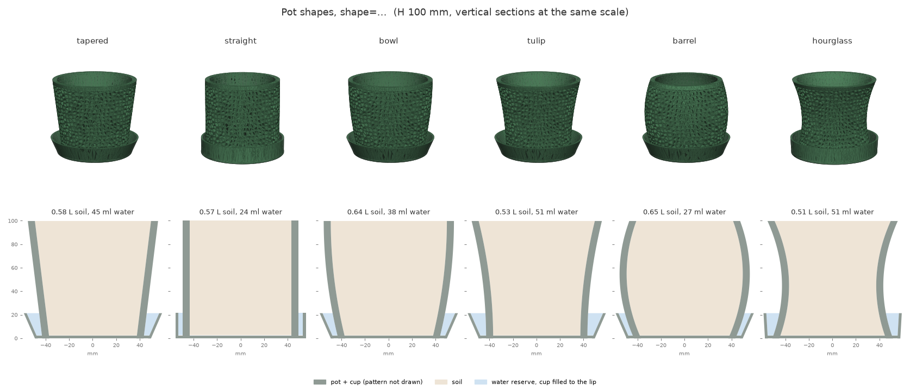

| `shape=` | Profile |
|---|---|
| `tapered` | Cone, narrow at the bottom. Default. |
| `straight` | Cylinder. Least water: the moat is only the 5·k mm gap. |
| `bowl` | Flares fast low down, near vertical at the rim. |
| `tulip` | Near vertical low down, flares out at the rim. |
| `barrel` | Bulges out a little above mid-height, narrower rim. Most soil. |
| `hourglass` | Narrow waist a little below mid-height. |

Every shape stays between the same narrowest and widest radius (56·k and
72·k mm). The patterns are drawn for that range, so every pattern keeps its
hole sizes, strut widths and 45° roofs on every shape (the voronoi wall stays
58% / 29% open on all six). No wall leans more than 24° from vertical, and
the cup follows the shape: it starts a moat gap out from the pot and its lip
sits just outside the widest part of the wall above it.

## Patterns

Pick one with `pattern=<name>`. Each image shows the 50 mm pot (`size=small`)
from outside, next to a 40 x 30 mm true-scale swatch of the outer wall face
(white = open) with its open %.

| | |
|---|---|
| **`voronoi`** (default), 2D, tapered: organic cells that flare outward like funnels. <br> 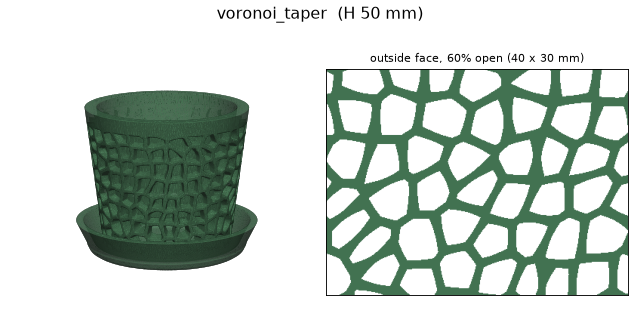 | **`hex`**, 2D, tapered: warped honeycomb, pointy-top cells, flaring outward like `voronoi`. <br> 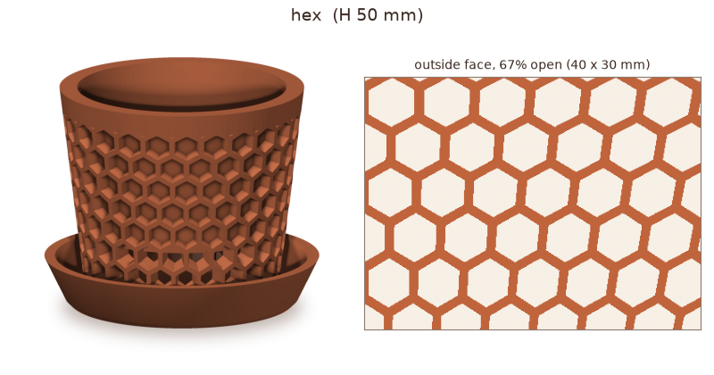 |
| **`drops`**, 2D, tapered: staggered teardrops with 55° pointed tops, flaring outward. <br> 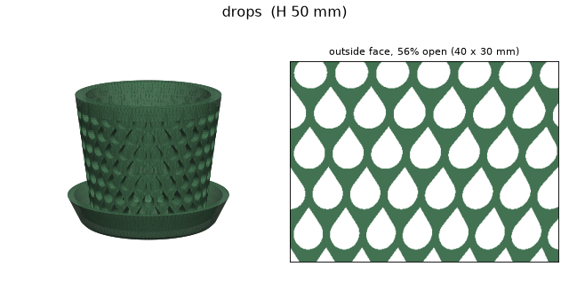 | **`lattice`**, 2D, tapered: diamond trellis of helical strips crossing at ±55°, no bridges at all, flaring outward like `voronoi`. <br> 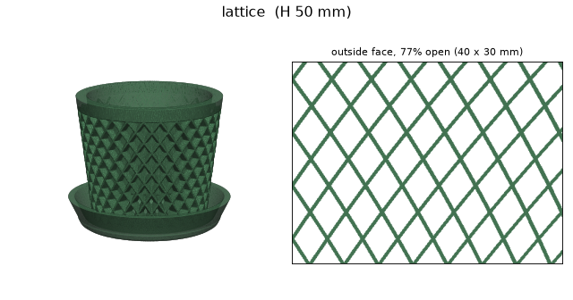 |
| **`isogrid`**, 2D, tapered: triangle grid flaring outward like `voronoi`; the downward triangles have short flat bridges. <br> 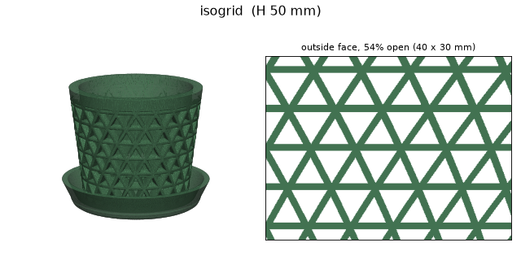 | **`louvers`**, 2D: gills that run down and outward through the wall like shutter blades. No line of sight: soil stays in, rain runs off. <br> 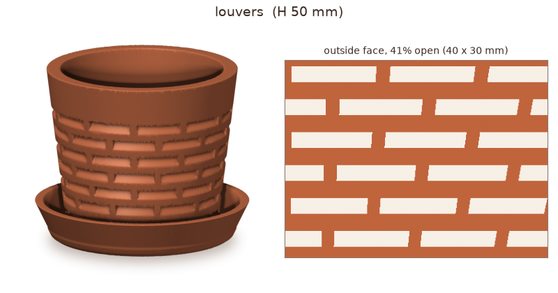 |
| **`slots`**, 2D: narrow wavy vertical slots, air-pruning style. <br> 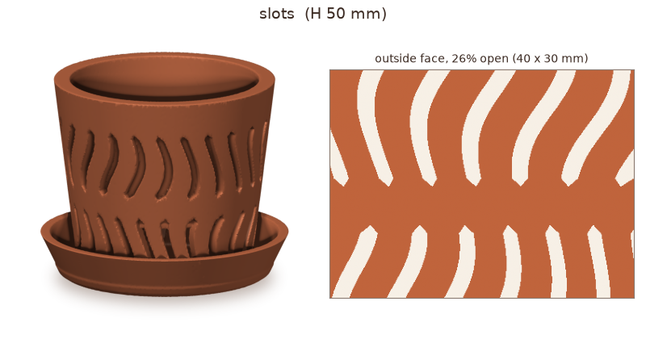 | **`spiral`**, 2D: slots on a many-start 60° helix. <br> 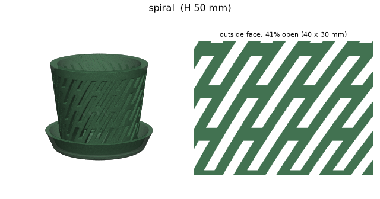 |
| **`chevrons`**, 2D: stacked arrowhead slots. <br> 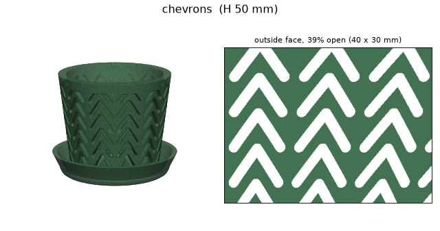 | **`weave`**, 3D: two sets of strips woven over and under through the wall (the swatch shows only where they touch the outer face). <br> 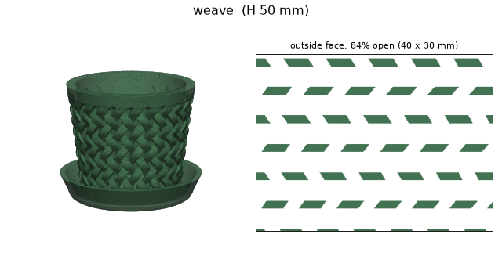 |

2D patterns are cut radially through the wall (louvers slope down through
it). All wrap seamlessly around the pot.
Sloped hole roofs are at least 55° from horizontal in the unrolled pattern,
so at least 45° on the real, tapered pot, and no hole closes into a loop,
so the wall is always one piece.

### Regenerating the gallery

`pots-gallery` builds every pattern one after another, in memory, and
writes only these images to `docs/patterns/<name>.png` (no STL, 3MF or
config; use `pots pattern=<name>` for a printable pot).

```sh
pots-gallery                          # every pattern (a few minutes in total)
pots-gallery hex slots                # only these
pots-gallery quality=draft            # faster, coarser
pots-gallery size=big --images pics   # the 100 mm pot, images in pics/
pots-gallery height=90 design.wall=5  # any shape setting of `pots`
pots-gallery --shapes size=big        # only docs/shapes.png: every pot shape (~9 min)
```

It takes the shape settings of `pots` (`size`, `height`, `design.*`,
`quality`). Mesh quality defaults to `quality.voxel=0.35
quality.faces=400000` (between draft and full, fine enough for the 1.1 mm
struts to show); any `quality=...` or `quality.*` on the command line
replaces that. Run it after changing a pattern so the README stays current.

## Printability rules

The generator follows these; keep them when changing the code:

- No supports anywhere.
- Every hole roof is a flat bridge no wider than the hole (≤ ~5 mm). The
  taper is done by shifting the pattern down as its edges recede, so holes
  only grow sideways and downward; a ceiling never rises toward the outside.
- Minimum strut ~1.1 mm (0.4 mm nozzle).
- 45° chamfer on the bottom outer edge (elephant foot).
- Every pattern is periodic around the circumference.

## Using it from Python

```python
from pots import Pot, generate
from pots.metrics import wall_metrics

pot = Pot(height=65, wall=4.0)                 # every size of one pot
mesh, field = generate(pot, "voronoi", voxel=0.6, faces=100_000)
mesh.export("pot.3mf")
print(wall_metrics(field, pot))                # open %, hole size on both faces
```

## Code layout

```
src/pots/
  cli.py        `pots` command: config, build, export, preview
  gallery.py    `pots-gallery` command: every pattern + README images
  config/       Hydra config: config.yaml and the quality/ and size/ presets
  geometry.py   Pot: all dimensions, scaled from the height
  patterns.py   wall patterns (PATTERNS registry)
  field.py      make_field(): wall + rim + base + cup as one implicit field
  sdf.py        field helper (smin)
  mesh.py       slab-wise marching cubes, decimation and repair
  solid.py      exact mesh: revolved pot minus lofted hole cutters (manifold3d)
  pipeline.py   generate(): exact or marching-cubes mesh, plus the field
  metrics.py    open %, hole size and straight-through % of both wall faces
  preview.py    PNG preview and the small gallery image
tests/          pytest suite (uv run pytest)
docs/patterns/  gallery images used in this README (pots-gallery)
docs/shapes.png pot shape sheet (pots-gallery --shapes size=big)
```

### How the mesh is made

Every pattern is defined as an implicit field (negative = solid). By
default it is meshed with marching cubes in z-slabs, then decimated,
reduced to its largest body and repaired. That works for any shape, but a
grid can't follow a sharp edge that runs across it: flat ribs come out
with sawtooth edges, and it takes many triangles.

Patterns whose holes are polygons can also give their hole outlines
directly (`Pattern.cutters`; the tapered ones: `voronoi`, `hex`, `drops`, `lattice`, `isogrid`). Then `solid.py` builds the
pot exactly with [manifold3d](https://github.com/elalish/manifold): the
plain pot is revolved from its profile, each hole is a loft from its
soil-side outline to its outside one, and all holes are subtracted at
once. Faces are flat and edges sharp, and it is watertight by
construction. For the 100 mm lattice pot:

| | marching cubes (`quality=full`) | exact |
|---|---|---|
| build | ~50 s | ~1.5 s |
| faces | 900 000 | ~100 000 |
| STL | 45 MB | 5 MB |

The exact mesh follows the field to within ~0.03 mm (the hole volume
matches within 0.6%, tested). Two small differences: the field's 1 mm
rounded blends where the wall meets the base and cup become 0.8 mm 45°
chamfers, and if the settings close the holes up inside the wall (a strut
wider than the cell), the build falls back to marching cubes.

Either way, each build logs whether the mesh is watertight and a single
body, plus the wall metrics (which always come from the field).

Hydra note: the config is loaded with Hydra's compose API rather than
`@hydra.main`, because hydra-core 1.3's own CLI crashes on Python 3.14.
The `key=value` syntax is the same; `--show` replaces `--cfg job`.

## Development

```sh
uv sync            # installs the dev group (pytest) too
uv run pytest      # ~35 s, includes small draft and exact builds
uv run pytest -m slow   # ~1 min: builds every pattern and every shape, checks for loose parts and overhangs
```
